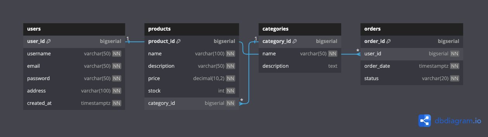

# ShopifyGo :rabbit:


## Schema DB

[](./assets/SchemaShopifyGo.png "Open image")

---

### Structure 

```bash
shopifygo/
│
├── cmd/
│   ├── userservice/
│   │   └── main.go         
│   ├── productservice/
│   │   └── main.go         
│   ├── orderservice/
│   │   └── main.go         
│   └── ...
│
├── pkg/
│   ├── user/
│   │   ├── user.go          
│   │   ├── repository.go    
│   │   └── service.go       
│   ├── product/
│   │   ├── product.go       
│   │   ├── repository.go    
│   │   └── service.go       
│   ├── order/
│   │   ├── order.go         
│   │   ├── repository.go    
│   │   └── service.go       
│   └── ...
│
├── internal/
│   ├── database/
│   │   ├── user_migration/    
│   │   │   ├── 001_initial_schema.up.sql
│   │   │   └── ...
│   │   ├── product_migration/ 
│   │   │   ├── 001_initial_schema.up.sql
│   │   │   └── ...
│   │   ├── order_migration/   
│   │   │   ├── 001_initial_schema.up.sql
│   │   │   └── ...
│   │   └── connection.go
│   │
│   ├── user/
│   │   ├── user_manager.go      
│   │   ├── user_validator.go    
│   │   └── ...
│   ├── product/
│   │   ├── product_manager.go   
│   │   ├── product_validator.go 
│   │   └── ...
│   ├── order/
│   │   ├── order_manager.go     
│   │   ├── order_validator.go   
│   │   └── ...
│   └── ...
│
├── configs/
│   ├── user_config.yaml     
│   ├── product_config.yaml  
│   ├── order_config.yaml    
│   └── ...
│
└── README.md
```
